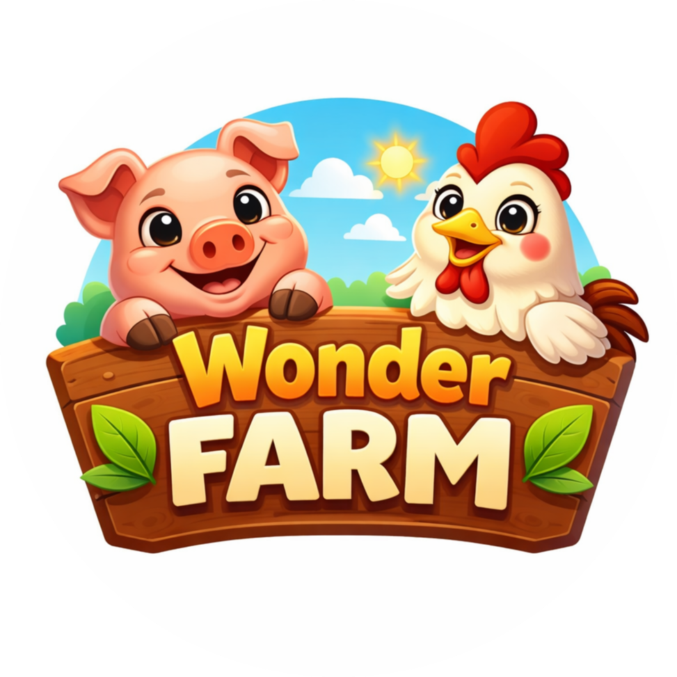
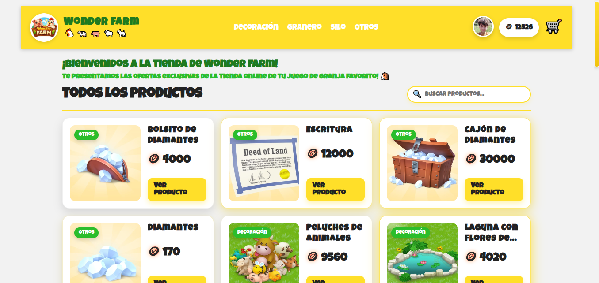

# Farm Game Store - Frontend

Frontend de la tienda de la granja **Wonder Farm**, construido con React y Vite. Incluye catálogo de productos, carrito, compras con monedas y notificaciones globales.

**Logo del juego:**

<p align="center">
	
</p>

**Home de la tienda:**



## Características
- Catálogo de productos con detalle.
- Filtro por categoría.
- Carrito de compras con persistencia en localStorage.
- Cálculo de totales e items.
- Notificaciones globales con Snackbar.
- Integración con Firebase/Firestore para datos.

## Tecnologías
-  React
-  Vite
-  Firebase (Firestore)
-  JavaScript
-  CSS
-  Node.js
-  npm
-  Vercel

## Requisitos
- Node.js 18+ (recomendado)
- npm, pnpm o yarn

## Instalación
1. Clonar el repositorio.
2. Instalar dependencias:
	 - `npm install`
3. Crear el archivo de entorno `.env` en la raíz (ver sección siguiente).
4. Iniciar el entorno local:
	 - `npm run dev`

## Variables de entorno
Este proyecto utiliza Vite, por lo que las variables deben tener el prefijo `VITE_`.

Ejemplo de `.env`:
```
VITE_FIREBASE_API_KEY=xxxxxxxxxxxxxxxxxxxxxxxxxxxx
VITE_FIREBASE_AUTH_DOMAIN=xxxxxxxxxxxxxxxxxxxxxxxx
VITE_FIREBASE_PROJECT_ID=xxxxxxxxxxxxxxxxxxxxxxxx
VITE_FIREBASE_STORAGE_BUCKET=xxxxxxxxxxxxxxxxxxxxxxxx
VITE_FIREBASE_MESSAGING_SENDER_ID=xxxxxxxxxxxxxxxxxxxxxxxx
VITE_FIREBASE_APP_ID=xxxxxxxxxxxxxxxxxxxxxxxx
```

## Usar mockService (sin Firestore)
Si quieres trabajar sin Firebase, puedes usar el servicio mock local:
1. Abrir [src/data/dataService.js](src/data/dataService.js).
2. Cambiar la constante `USE_SERVICE` a `mockService`.
3. Reiniciar el servidor de desarrollo.

Este modo evita llamadas a Firestore y usa datos locales definidos en [src/data/mockService.js](src/data/mockService.js) y [src/data/products.js](src/data/products.js).

## Scripts disponibles
- `npm run dev`: inicia el servidor de desarrollo.
- `npm run build`: genera el build de producción.
- `npm run preview`: previsualiza el build localmente.
- `npm run lint`: ejecuta ESLint.

## Estructura del proyecto
```
src/
	components/         # Componentes UI
	context/            # Contextos (carrito, notificaciones, usuario)
	data/               # Servicios y fuentes de datos
	App.jsx
	main.jsx
public/
	imgs/
```

## Deploy en Vercel
Para aplicaciones SPA con Vite, se utiliza un rewrite global para evitar errores al recargar rutas. Ya existe un `vercel.json` con esta configuración.

Además, debes configurar las variables de entorno en el panel de Vercel usando los mismos nombres del `.env`.

## Calidad de código
- ESLint configurado para mantener un estilo consistente.
- Contextos documentados en español.

## Contribución
1. Crear un fork del proyecto.
2. Crear una rama con el cambio: `feature/nombre-cambio`.
3. Abrir un Pull Request con una descripción clara.

